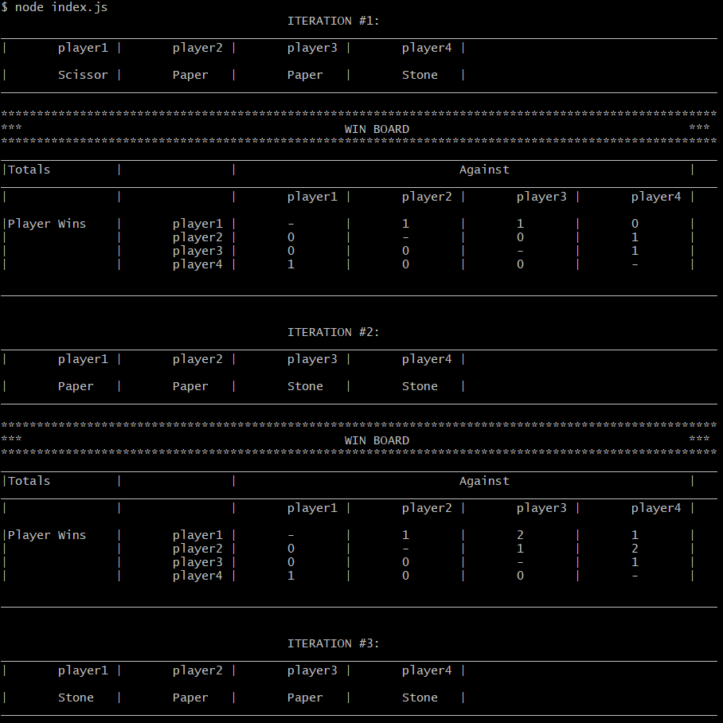

# stone-paper-scissor
A small simulation of the game Stone-Paper-Scissor using node.js.

## Few Details:
* To run, clone repo and go inside project directory and run index.js `~$ node index.js` :sunglasses:
* No input is required. By default it simulates 4 players playing against each other.
* You can view the Win Board, Lose Board, Draw Board all or any of them in CLI by commenting or uncommenting the [code lines](https://github.com/kushagra-shukla/stone-paper-scissor/blob/abc3e4d2ef7170ed1e40825990fea2f2a55aea6d/src/game_logic/play_game.js#L114-L116) in play_game.js. Only Win Board is shown by default.
* You can change the number of simulations in index.js file [code line](https://github.com/kushagra-shukla/stone-paper-scissor/blob/abc3e4d2ef7170ed1e40825990fea2f2a55aea6d/index.js#L5). Default value is 50.
* Number of players can also be changed but that requires making changes in [score_board.js](src/data_model/scoreboard.js) and  [init_game.js](src/game_logic/init_game.js). :fearful:
* The above process can be made easy by warranting a user input upfront about number of players and number of simulations to run but that functionatlity is left for now.

## Output Samples in CLI:
* Sample output in CLI of Win Board.

* Sample output in CLI of Win and Lose Board.

* Sample output in CLI of Win, Lose and Draw Board.

* Cumulative view of total wins, lose and draws for each player can also be viewed by uncommenting [code lines](https://github.com/kushagra-shukla/stone-paper-scissor/blob/abc3e4d2ef7170ed1e40825990fea2f2a55aea6d/index.js#L11) in index.js. 

